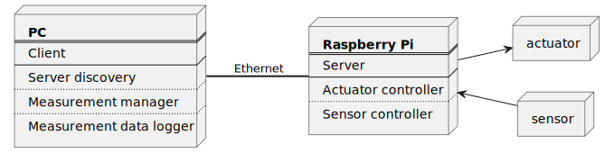

# Quick Start
- Clone repo: `gh repo clone ksalwin/raspi-control -- --recurse-submodules`
- Build and run client: `sh run-client.sh`

# raspi-control
The purpose of this program is to connect to a Raspberry Pi and to control measurements
and actuators.

    

